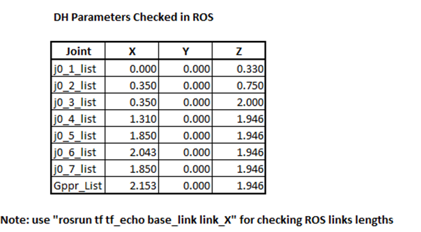

## Project: Kinematics Pick & Place
### Writeup Template: You can use this file as a template for your writeup if you want to submit it as a markdown file, but feel free to use some other method and submit a pdf if you prefer.

---

**Steps to complete the project:**  

1. Set up your ROS Workspace.
2. Download or clone the [project repository](https://github.com/udacity/RoboND-Kinematics-Project) into the ***src*** directory of your ROS Workspace.  
3. Experiment with the forward_kinematics environment and get familiar with the robot.
4. Launch in [demo mode](https://classroom.udacity.com/nanodegrees/nd209/parts/7b2fd2d7-e181-401e-977a-6158c77bf816/modules/8855de3f-2897-46c3-a805-628b5ecf045b/lessons/91d017b1-4493-4522-ad52-04a74a01094c/concepts/ae64bb91-e8c4-44c9-adbe-798e8f688193).
5. Perform Kinematic Analysis for the robot following the [project rubric](https://review.udacity.com/#!/rubrics/972/view).
6. Fill in the `IK_server.py` with your Inverse Kinematics code. 

[//]: # (Image References)

[image1]: ./misc_images/misc1.png
[image2]: ./misc_images/kuka1.PNG
[image3]: ./misc_images/kuka2.PNG

## [Rubric](https://review.udacity.com/#!/rubrics/972/view) Points
### Here I will consider the rubric points individually and describe how I addressed each point in my implementation.  

---
## Writeup / README

#### 1. Provide a Writeup / README that includes all the rubric points and how you addressed each one.  You can submit your writeup as markdown or pdf.  

You're reading it!

### Kinematic Analysis
#### 1. Run the forward_kinematics demo and evaluate the kr210.urdf.xacro file to perform kinematic analysis of Kuka KR210 robot and derive its DH parameters.

The basic breakdown of the links and base is shown below. The Kuka Arm KR210 robot has 6 Degrees of Freedom (DOF) with 6 joints and 5 links. Joint 0 is the “fixed” base link with a direct connection to Joint 1 that creates an offset of .33. Joint 1 connects to Joint 2 with a .42 offset with a link connection of .38. Joint 2 connects to Joint 3 with a direct link with a 1.25 offset. Joint 3 connects to Joint 4 by a .96 link and offset of a -.054. Joint 4 connects to Joint 5 (wrist) with a .54 link. Joint 5 connects to the hand by a .193 link. The hand consists of a left and right finger of .11. Total length of the arm from the center of the base is 2.153. The total offset from the center of the base in a positive Z direction is 1.946. This data is derived from the xacro file as part of the simulation world for this project.  
##### Figure 1

#### 2. Using the DH parameter table you derived earlier, create individual transformation matrices about each joint. In addition, also generate a generalized homogeneous transform between base_link and gripper_link using only end-effector(gripper) pose.

DH Parameter Table

link | alpha j-1 | a i-1 | d i-1 | Theta i
--- | --- | --- | --- | ---
1 | 0 | 0 | 0.75 | Theta 1
2 | -pi/2 | 0.35 | 0| Theta 2
3 | 0 | 1.25 | 0 | Theta 3
4 | -pi/2 | -0.054 | 1.5 | Theta 4 
5 | pi/2 | 3 | 0 | Theta 5
6 | -pi/2| 3 | 0 | Theta 6
7 | 0 | 3 | 0.303 | 0

Figure 2 Below represents the Kuka Arm in a table without the descriptions as noted in section 1 above. Key aspect is that I also list the joint matrix variable in an easy human format with the headers in line one and joints incrementally addressed from 0 to the Gripper.  Column X in the figure below represents the X coordinates of lengths as normally seen to the right of the origin (horizontal) with the column Y being the vertical coordinate as found in any Cartesian System.  Column Z represents the third dimension of the robotic arm by showing the offset of a perfect vertical plane from the center of the base though the arm until the gripper. The chart differs from Figure 1 in that we are only looking the Joints with respect to sum of the total lengths to each joint. 
If the number carries the same value to the next row and in the same column, the arm for all purposes length has not changed. The length in X of JO_2_List and JO_3_List is 0.350. This means no additional length of the link has been added. The next line then is a summation of the total links to that that point in the arm. From the base to the end of the Gripper is 2.153 with the total offset of 1.946. 
The data in this table should reflect what is in Figure 1 with the knowledge that the values in this table were acquired by using a Terminal Window with the ping or echo back of the parameters of XYZ.         
##### Figure 2

#### 3. Decouple Inverse Kinematics problem into Inverse Position Kinematics and inverse Orientation Kinematics; doing so derive the equations to calculate all individual joint angles.

The solution to decoupling the inverse kinematics problem in by dividing the smaller problems as the inverse position and inverse orientation. The Kuka Arm KR210 is a 6 DOF manipulator with a spherical wrist. So, we simply find the position of the intersection of the wrist axes and the wrist center Figure 3.  Then we find the orientation of the wrist. 
I used the px, py, pz variables to get the position of the end-effector data acquired from ROS.  I then used that data to find the wrist_center = trigsimp(P_xyz - 0.303 * R0_6 * Matrix([[1],[0],[0]])).  At the same time I used the (Roll, Yaw, Pitch) data to construct a variable to trigsimp(R_roll * R_pitch * R_yaw) that allowed me to compute the overall transformation.    

##### Figure 3

### Project Implementation

#### 1. Fill in the `IK_server.py` file with properly commented python code for calculating Inverse Kinematics based on previously performed Kinematic Analysis. Your code must guide the robot to successfully complete 8/10 pick and place cycles. Briefly discuss the code you implemented and your results. 

The Ik_server.py file required additional coding for the Inverse Kinematics (IK). In this process, I use python based coding to convert equations used to calculate the join angles for the KUKA arm KR210 by working backwards from a list of end-effector poses (fancy name for the gripper).  In general, there are 6 required items as listed below but each may have multiple issues and coding necessary to address the requirement.    
1)	Define DH param symbols
2)	Joint angle symbols    
3)	Modified DH params
4)	Define Modified DH Transformation matrix
5)	Create individual transformation matrices
6)	Calculate joint angles using Geometric IK method

I first assigned symbols to each link a(x), joint angle q(x), offset d(x), and twist angle alpha(x) to complete items 1 and 2. Then for the Modified DH (item 3 and 4) , a matrix was used in the form of  {alpha0: X,     a0: X,    d1: X, q0:X} as need for each DH symbol to represent the joint and length for each segment.  
Individual transformation matrices (item 5) were completed for each joint as per Denavit–Hartenberg convention as seen for a serial robot arm having 6 DOF. The matrix convention Figure 4 below allows each joint to be define in the DH syntax. 
##### Figure 4

Next I did a trigsimp transformation for each to finally arrive at the end-effector derived from the individual matrices – in a form of Tx_x = trigsimp(Tx_1 * Tx_2). 
The orientation of the gripper needed to be corrected in differences between the definition of gripper link in URDF verse the DH parameters. This was done by first a rotation (R) around the Z-axis (R-z) and then about the Y-Axis (R_y). Other calculations in this section include a total for the rotation correction and a transformational matrix.  
For item 6, I completed a full list of the Calculate joint angles using Geometric IK method by running the rosrun command as seen in figure 2, The entire list may not have been necessary but may be of use in the future - j0_5_list = [1.85, 0, 1.946].  The numbers found in the matrix is directly from the echo command in ROS. 

Finally, I do some pre-calculations to simply the process of getting the Thetas needed for sending the IK back to the robotic arm.  Of those I use the python atan2 to return the quadrant of the angle as you can define the sign of the X and Y.  The results are Theta1-6 are calculated and returned to ROS for the arm in CalculateIKResponse(joint_trajectory_list). 

